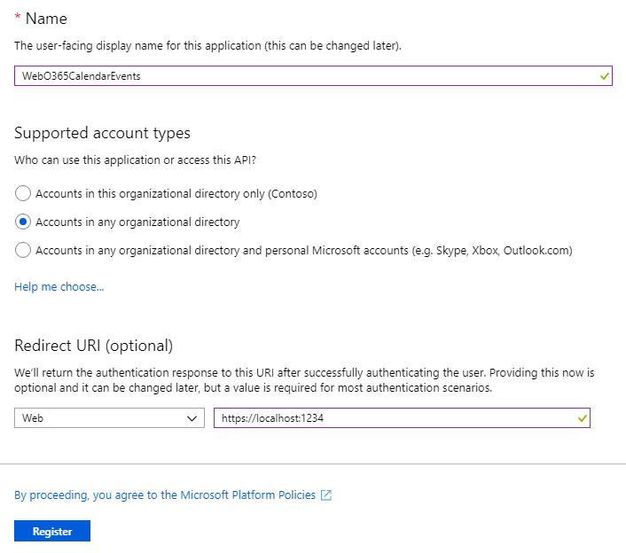
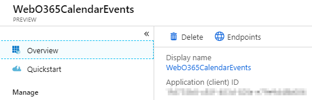
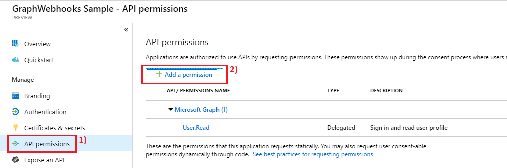
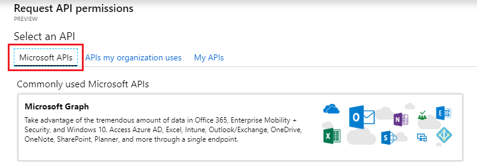
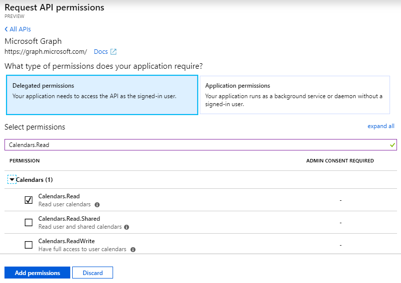

# Create an Azure AD web application with the App Registration Portal

In this demo, you will create a new Azure AD native application using the App Registry Portal (ARP).

1. Visit the [Azure Active Directory admin center](https://aad.portal.azure.com) and login using a **Work or School Account**.

1. Select **Azure Active Directory** in the left-hand navigation, then select **App registrations (Preview)** under **Manage**.

    

1. Select **New registration**. On the **Register an application** page, set the values as follows.

    - Set a preferred **Name** e.g. `WebO365CalendarEvents`.
    - Set **Supported account types** to **Accounts in any organizational directory**.
    - Under **Redirect URI**, set the first drop-down to Web and set the value to the `https://localhost:1234`.
    > You will eventually have to come back to add a new URL to this when we know the SSL of the ASP.NET application that you will build in an exercise later in this lab.

    

1. Choose **Register**. On the **WebO365CalendarEvents** page, copy the value of the **Application (client) ID** and save it, you will need it in the next step.

    

1. Select **Authentication** under **Manage**. Locate the **Implicit grant** section and enable **ID tokens**. Choose **Save**.

    

1. Select **Certificates & secrets** under **Manage**. Select the **New client secret** button. Enter a value in **Description** and select one of the options for **Expires** and choose **Add**.

    

1. Copy the client secret value before you leave this page. You will need it in the next step.

    > **IMPORTANT**:
    > This client secret is never shown again, so make sure you copy it now.

    

1. From the **Manage** page, select **API permissions** > **Add a permission**.

    

1. Choose **Microsoft API** > **Microsoft Graph**.

    

1. Choose **Delegated permissions**. In the search box, type **Calendars.Read** and select the first option from the list. Select **Add permissions**.

    